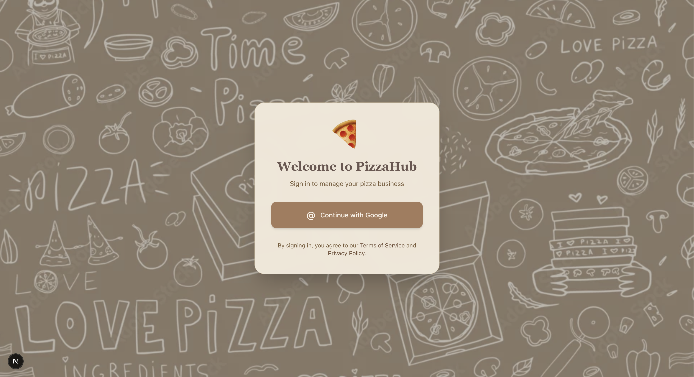
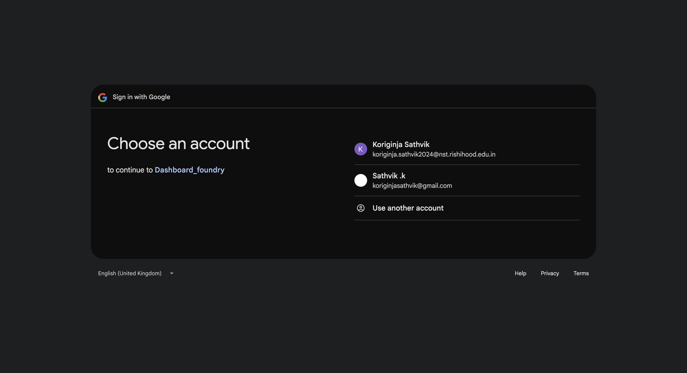
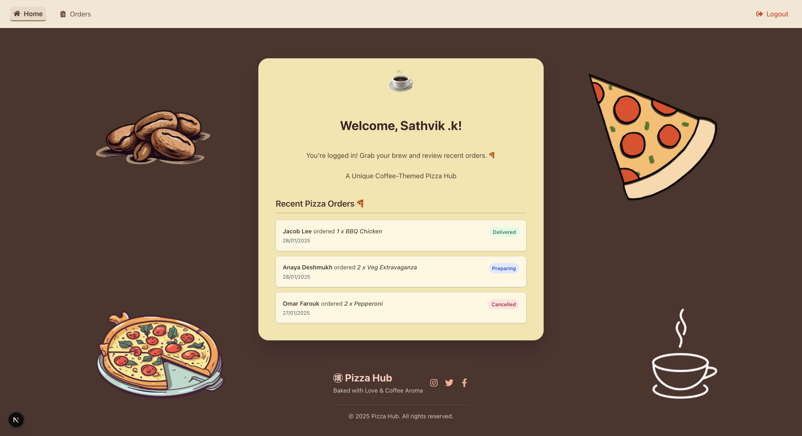
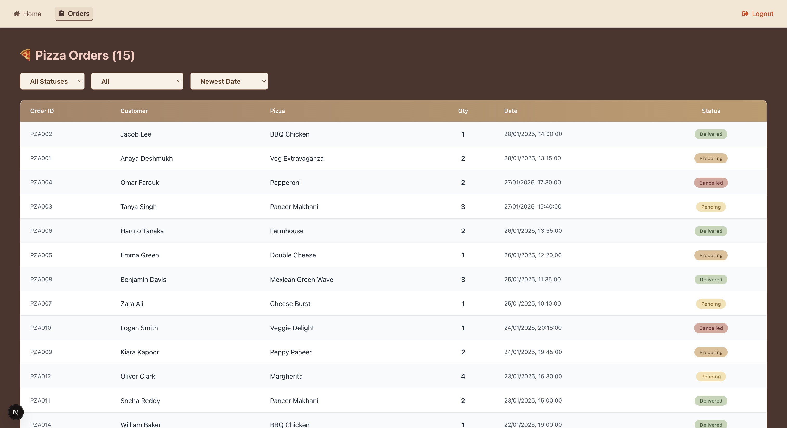

# Pizza Hub - Dashboard

**Developer:** Sathvik koriginja

## Project Overview

Pizza Hub is a modern Next.js app with Google sign-in, real-time order filtering, and a cozy coffee-themed design—making pizza order management simple and enjoyable.

##  Screenshot







## Technology Stack

- **Framework:** Next.js 14 (App Router)
- **Authentication:** NextAuth.js with Google Provider
- **Styling:** Tailwind CSS
- **Icons:** React Icons
- **Deployment:** Vercel

## Local Development Setup

### Prerequisites

- Node.js 18+ installed
- Google Cloud Console account
- Git installed

### Installation Steps

1. **Clone the repository**
   ```bash
   git clone https://github.com/sathvik89/Dashboard_foundry.git
   cd dashboard_foundry
   ```

2. **Install dependencies**
   ```bash
   npm install
   ```

3. **Set up Google OAuth**
   - Go to [Google Cloud Console](https://console.cloud.google.com/)
   - Create a new project or select existing one
   - Enable Google+ API
   - Create OAuth 2.0 credentials
   - Add authorized redirect URIs:
     - `http://localhost:3000/api/auth/callback/google` (development)
     - `https://your-domain.vercel.app/api/auth/callback/google` (production)

4. **Configure environment variables**
   Create a `.env.local` file in the root directory:
   ```env
   GOOGLE_CLIENT_ID=your_google_client_id_here
   GOOGLE_CLIENT_SECRET=your_google_client_secret_here
   NEXTAUTH_SECRET=your_random_secret_string_here
   NEXTAUTH_URL=http://localhost:3000
   ```

   ** Important:** Never commit the `.env.local` file to version control!

5. **Run the development server**
   ```bash
   npm run dev
   ```

6. **Open your browser**
   Navigate to `http://localhost:3000`


## Deployment

### Vercel Deployment

1. **Push to GitHub**
   ```bash
   git add .
   git commit -m "Initial commit"
   git push origin main
   ```

2. **Deploy to Vercel**
   - Go to [vercel.com](https://vercel.com)
   - Import your GitHub repository
   - Add environment variables in Vercel dashboard
   - Deploy

3. **Update Google OAuth**
   - Add your Vercel domain to Google Cloud Console
   - Update authorized redirect URIs


## Challenges Faced & Solutions

1. **Client/Server Component Confusion**
   - **Challenge:** Mixing useState hooks in server components
   - **Solution:** Separated client and server logic properly

2. **Authentication State Management**
   - **Challenge:** Session not persisting across pages
   - **Solution:** Implemented SessionProvider wrapper

3. **Deployment Issues**
   - **Challenge:** Environment variables and OAuth configuration

## Third-Party Libraries

- **next-auth**: Authentication library for Next.js
- **react-icons**: Icon library for React
- **tailwindcss**: Utility-first CSS framework

## Assumptions Made

- Google OAuth is the only required authentication method
- No backend database integration needed

## Future Enhancements

- Add real-time order updates
- Implement order status modification
- Add order creation functionality
- Integrate with a real database
- Add unit and integration tests
- Implement role-based access control


## Thankyou Looking for your feedback

